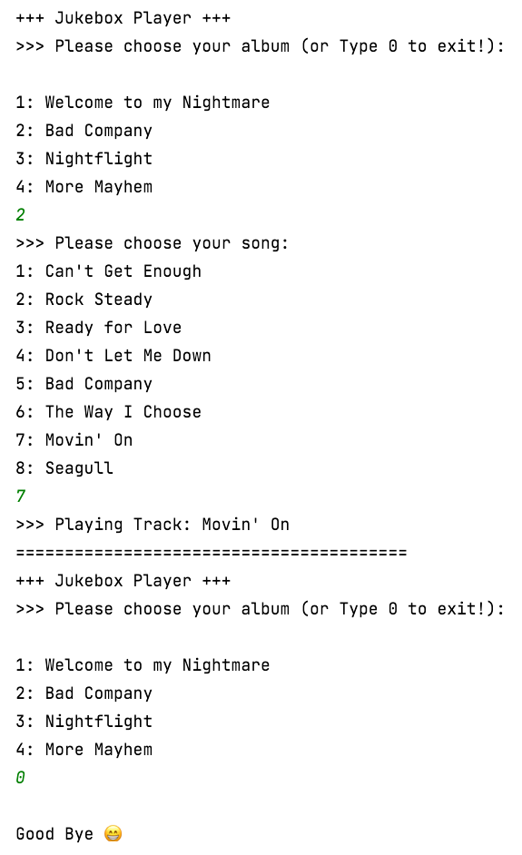

# Simple Jukebox 

Console-based Jukebox music player application, written in Python language. 

## Getting Started

These instructions will get you a copy of the project.

### Installing

1. Clone the git repo

```
git clone https://github.com/AAdewunmi/Simple_JukeBox.git
```

2. Open Project Folder


3. Explore

```
Enjoy :)
```

### Screenshot



---
#### Source: 
"Learn Python Programming Masterclass" 

Created by Tim Buchalka, Jean-Paul Roberts, Tim Buchalka's Learn Programming Academy on Udemy

URL: https://www.udemy.com/course/python-the-complete-python-developer-course/
 
